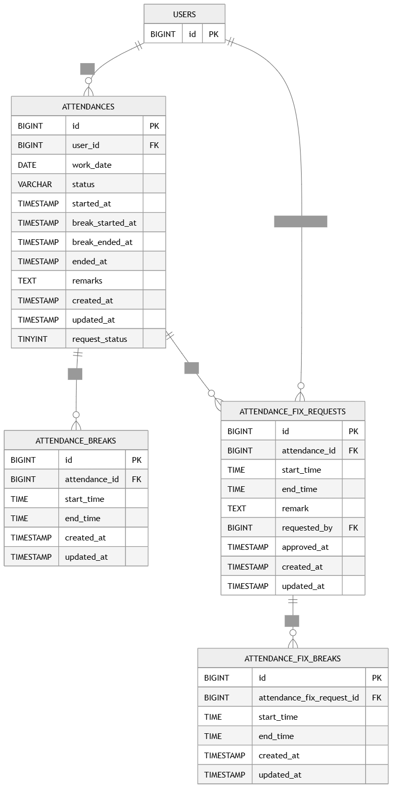

# Coachtech-Attendance

## 環境構築

Dockerビルド

* git clone <https://github.com/M0634/coachtech-furima.git>
* docker-compose up -d --build

Lalavel環境構築

* docker compose up -d
* docker compose exec php composer install
* cp .env.example .env
* docker compose exec php php artisan key:generate
* php artisan maigrate
* php artisan db:seed
* npm install
* npm run dev

## 使用技術

* PHP 8.0
* nginx 1.21.1
* MySQL 8
* Laravel 8.x
* Laravel Fortify（認証機能）
* Laravel Sanctum（API 認証）
* Laravel UI（Bootstrap / 認証 scaffolding）
* Laravel Tinker
* Doctrine DBAL（スキーマ操作用）
* Stripe-PHP（決済処理）

## ER図

## 開発環境
http://localhost/
