# 勤怠管理アプリ（模擬案件）

## 概要
Laravelを使用して開発した勤怠管理システムです。

ユーザーは勤怠打刻・休憩管理・修正申請を行うことができ、  
管理者は申請内容の確認・承認を行えます。

---

## 機能一覧

### 一般ユーザー
- 会員登録 / ログイン
- 勤怠打刻
- 休憩開始・終了
- 勤怠一覧表示
- 勤怠修正申請
- メール認証

### 管理者
- スタッフ一覧
- 勤怠確認
- 修正申請承認

---

## 環境構築

### ① リポジトリ取得

```bash
git clone https://github.com/M0634/coachtech-furima.git
cd coachtech-furima
```

### ② Dockerビルド

```bash
docker compose up -d --build
```

### ③ Laravel環境構築

```bash
docker compose exec php composer install
cp .env.example .env
docker compose exec php php artisan key:generate
docker compose exec php php artisan migrate
docker compose exec php php artisan db:seed
```

### ④ フロント環境構築

```bash
docker compose exec php npm install
docker compose exec php npm run dev
```

---

## アクセスURL

| 内容 | URL |
|---|---|
| アプリ | http://localhost |
| phpMyAdmin | http://localhost:8080 |
| MailHog | http://localhost:8025 |

---

## 使用技術

- PHP 8.1
- Laravel 8.x
- Laravel Fortify（認証機能）
- Laravel Sanctum（API認証）
- Laravel UI
- MySQL 8.0
- Nginx 1.21.1
- Docker / Docker Compose
- Laravel Mix

---

## データベース設定（.env）

```env
DB_CONNECTION=mysql
DB_HOST=mysql
DB_PORT=3306
DB_DATABASE=laravel_db
DB_USERNAME=laravel_user
DB_PASSWORD=laravel_pass
```

---

## メール設定（MailHog）

```env
MAIL_HOST=mailhog
MAIL_PORT=1025
```

## ER図

